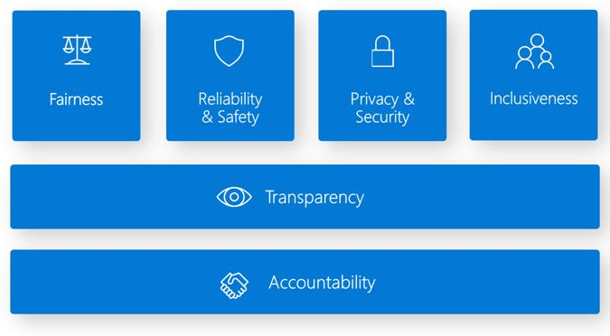
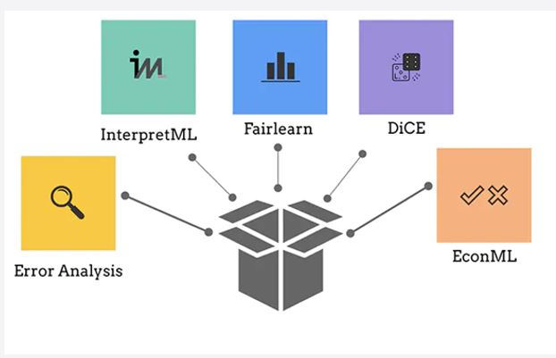
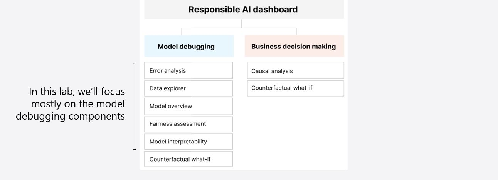

# Azure ResponsibleAI Dashboard Guide

## Introduction
Welcome to the documentation for Azure Responsible AI! This guide will walk you through the steps to use Responsible AI tools and features on the Azure platform to ensure ethical and responsible AI practices in your projects.

## Table of Contents
1. [Overview](#overview)
2. [Getting Started](#getting-started)
    - [Prerequisites](#prerequisites)
    - [Installation](#installation)
3. [Examples](#examples)
    - [Regression Model](#regression-model)
    - [Classification Model](#classification-model-(coming-soon..))
    - [Object Detection Model](#object-detection-model-(coming-soon..))
4. [License](#license)

## Overview

In today's data-driven world, the demand for machine learning models that not only excel in accuracy but also adhere to ethical principles has never been more pronounced. AI innovation is occurring at a rapid pace, companies are accelerating the adoption of AI, societal expectations are evolving, and governments are regulating AI in response.

### What is Responsible AI?

Responsible AI is an approach to developing, assessing, and deploying AI systems in a safe, trustworthy, and ethical way. Microsoft’s Responsible AI Standard defines 6 principles to guide responsible AI practices.



### What is the Responsible AI Dashboard?

The Responsible AI dashboard provides a unified interface to core open-source tools from Microsoft and the community that can help AI practitioners assess how well their models follow those principles.



### Responsible AI Dashboard Components

The Responsible AI Dashboard includes model debugging and business decision-making tools that can be composed into an end-to-end assessment workflow. These components empower AI practitioners to thoroughly evaluate their models and ensure adherence to ethical guidelines.




### Microsoft Responsible AI Team

ResponsibleAI at Microsoft is championed by a dedicated team committed to advancing ethical AI practices. Key members of the team include:

- **Ruth Yakubu:** [GitHub](https://github.com/ruyakubu)
- **Nitya Narasimhan:** [GitHub](https://github.com/nitya)

### Microsoft Learn Collection

To deepen your understanding and skills in Responsible AI, Microsoft offers a comprehensive collection titled "[Responsible AI Resources - For Developers](https://learn.microsoft.com/en-us/collections/mp71u687j65m7r?wt.mc_id=studentamb_299177)". This collection guides you through essential practices using the Responsible AI Dashboard.

## Getting Started
### Prerequisites
- Azure Subscription

### Installation

#### Option 1: Working on the Local Machine

1. **Clone the Repository:**
   ```
   git clone https://github.com/kershrita/ResponsibleAI-Dashboard-Guide
   cd ResponsibleAI-Dashboard-Guide/lib
   ```

2. **Create Conda Environment:**
   ```
   conda env create -f environment.yml -n RAI
   ```

3. **Activate Conda Environment:**
   ```
   conda activate RAI
   ```

4. **Install Dependencies:**
   ```
   pip install -r requirements.txt
   ```

Now, you have set up your local environment for Responsible AI. You can proceed with using the Responsible AI features in your project.

--------------------------------------

#### Option 2: Working Remotely in GitHub Codespaces

1. **Open GitHub Codespace:**
   Open the repository in GitHub Codespaces. After the Codespace is loaded, navigate to the `lib` directory.


2. **Run Commands in Terminal:**
   Open the terminal in Codespaces and execute the following commands:

   ```
   cd lib
   pip install -r requirements.txt
   ```

   This will install the required dependencies in your GitHub Codespace.

Now, whether you're working on your local machine or remotely in GitHub Codespaces, you have successfully set up the environment for Responsible AI. You can proceed with using the features of Responsible AI in your project.

## Examples
Provide real-world examples to illustrate the usage of Responsible AI in different scenarios.

### Regression Model
debug a machine learning regression model using RAI

### Classification Model (coming soon..)
debug a machine learning classification model using RAI

### Object Detection Model (coming soon..)
debug a deep learning object detection model using RAI

[source 1](https://techcommunity.microsoft.com/t5/ai-machine-learning-blog/debug-object-detection-models-with-the-responsible-ai-dashboard/ba-p/3825658)

## License
This repository is released under the [MIT License](LICENSE).

