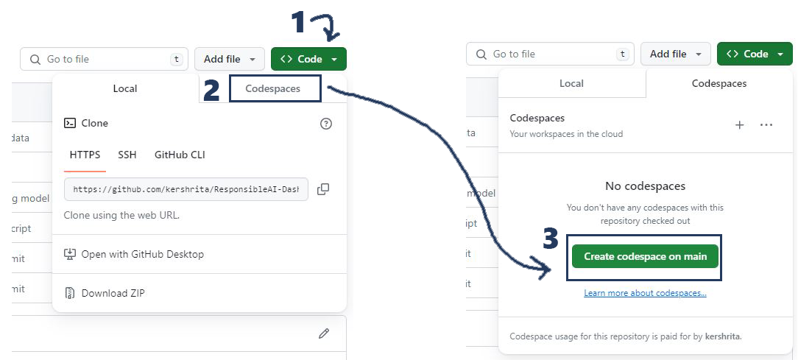

# Azure Responsible AI Documentation

## Introduction
Welcome to the documentation for Azure Responsible AI! This guide will walk you through the steps to use Responsible AI tools and features on the Azure platform to ensure ethical and responsible AI practices in your projects.

## Table of Contents
1. [Overview](#overview)
2. [Getting Started](#getting-started)
    - [Prerequisites](#prerequisites)
    - [Installation](#installation)
3. [Usage](#usage)
    - [Configuring Responsible AI](#configuring-responsible-ai)
    - [Monitoring Model Bias](#monitoring-model-bias)
    - [Explainability](#explainability)
4. [Examples](#examples)
    - [Example 1: Configuring Responsible AI](#example-1-configuring-responsible-ai)
    - [Example 2: Monitoring Model Bias](#example-2-monitoring-model-bias)
    - [Example 3: Explainability](#example-3-explainability)
5. [Best Practices](#best-practices)
6. [Troubleshooting](#troubleshooting)
7. [Contributing](#contributing)
8. [License](#license)

## Overview
Provide a brief overview of what Azure Responsible AI is and its key features. Include any relevant links to official documentation or additional resources.

## Getting Started
### Prerequisites
- Azure Subscription

### Installation

#### Option 1: Working on the Local Machine

1. **Clone the Repository:**
   ```
   git clone https://github.com/kershrita/ResponsibleAI-Dashboard-Guide
   cd ResponsibleAI-Dashboard-Guide/lib
   ```

2. **Create Conda Environment:**
   ```
   conda env create -f environment.yml -n RAI
   ```

3. **Activate Conda Environment:**
   ```
   conda activate RAI
   ```

4. **Install Dependencies:**
   ```
   pip install -r requirements.txt
   ```

Now, you have set up your local environment for Responsible AI. You can proceed with using the Responsible AI features in your project.

--------------------------------------

#### Option 2: Working Remotely in GitHub Codespaces

1. **Open GitHub Codespace:**
   Open the repository in GitHub Codespaces. After the Codespace is loaded, navigate to the `lib` directory.



2. **Run Commands in Terminal:**
   Open the terminal in Codespaces and execute the following commands:

   ```
   cd lib
   pip install -r requirements.txt
   ```

   This will install the required dependencies in your GitHub Codespace.

Now, whether you're working on your local machine or remotely in GitHub Codespaces, you have successfully set up the environment for Responsible AI. You can proceed with using the features of Responsible AI in your project.


## Usage
Explain how to use the key features of Azure Responsible AI. Provide step-by-step instructions and code snippets where necessary.

### Configuring Responsible AI
Explain how to configure Responsible AI for your specific use case. Include details about the parameters and options available.

### Monitoring Model Bias
Guide users on monitoring model bias using Azure Responsible AI. Include information on setting thresholds and interpreting results.

### Explainability
Detail how to incorporate explainability into your AI models using Azure Responsible AI. Provide insights into interpreting explanations.

## Examples
Provide real-world examples to illustrate the usage of Responsible AI in different scenarios.

### Example 1: Configuring Responsible AI
Include a code snippet or example configuration for setting up Responsible AI in a sample project.

### Example 2: Monitoring Model Bias
Show a practical example of how to monitor model bias using Azure Responsible AI.

### Example 3: Explainability
Demonstrate how to enhance model explainability with Responsible AI in a specific use case.

## Best Practices
Offer best practices and tips for using Azure Responsible AI effectively and responsibly.

## Troubleshooting
Include a troubleshooting section for common issues users may encounter and their solutions.

## Contributing
Encourage users to contribute to the documentation or report issues. Provide guidelines for contributing.

## License
Specify the license information for your documentation.
